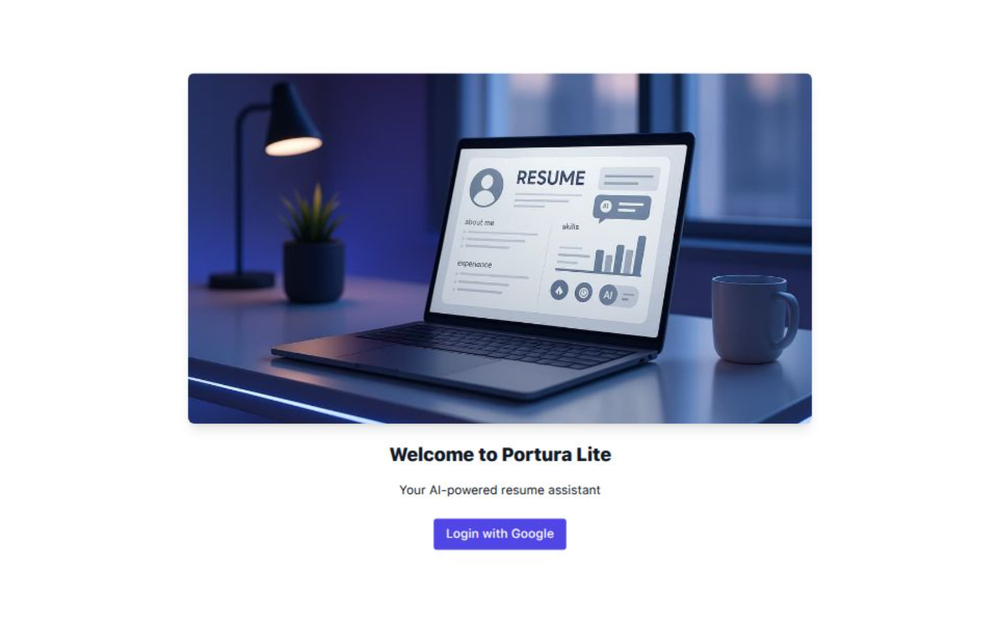

# 📝 Portura Lite

**Portura Lite** is a minimal full-stack AI-powered resume assistant. Users can upload a PDF or DOCX resume, have it parsed into structured data using OpenAI. They can also chat with an AI assistant about their resume content and get feedback and suggestions on how to improve it for job applications.

Built with **React**, **Next.js**, **MongoDB**, and **OpenAI**.

---

## 🚀 Features

-   ✅ Resume upload (PDF/DOCX)
-   ✅ AI-powered resume parsing (OpenAI GPT-4)
-   ✅ Structured JSON output (skills, experience, education, etc.)
-   ✅ Save parsed data to MongoDB
-   ✅ AI chat assistant (ask questions about your resume)
-   ✅ Instant feedback and improvement suggestions

---

## 🖼️ Demo

🔗 [Live Preview on Vercel](https://portura-lite.vercel.app)



---

## 🏗️ Tech Stack

-   **Frontend**: Next.js (App Router), Tailwind CSS
-   **Backend**: API Routes (Next.js)
-   **Database**: MongoDB Atlas
-   **Auth**: NextAuth.js (email/password or GitHub/Google)
-   **AI**: OpenAI GPT-4
-   **PDF/DOCX Parsing**: `pdf-parse`, `mammoth`

---

## 🛠️ Setup Instructions

1. **Clone the repository**
    ```bash
    git clone https://github.com/your-username/portura-lite.git
    cd portura-lite
    ```

## 📄 License

MIT License

## 🙋‍♂️ Author

Made by @ArbiStepanian
Inspired by the vision for portura.ai
